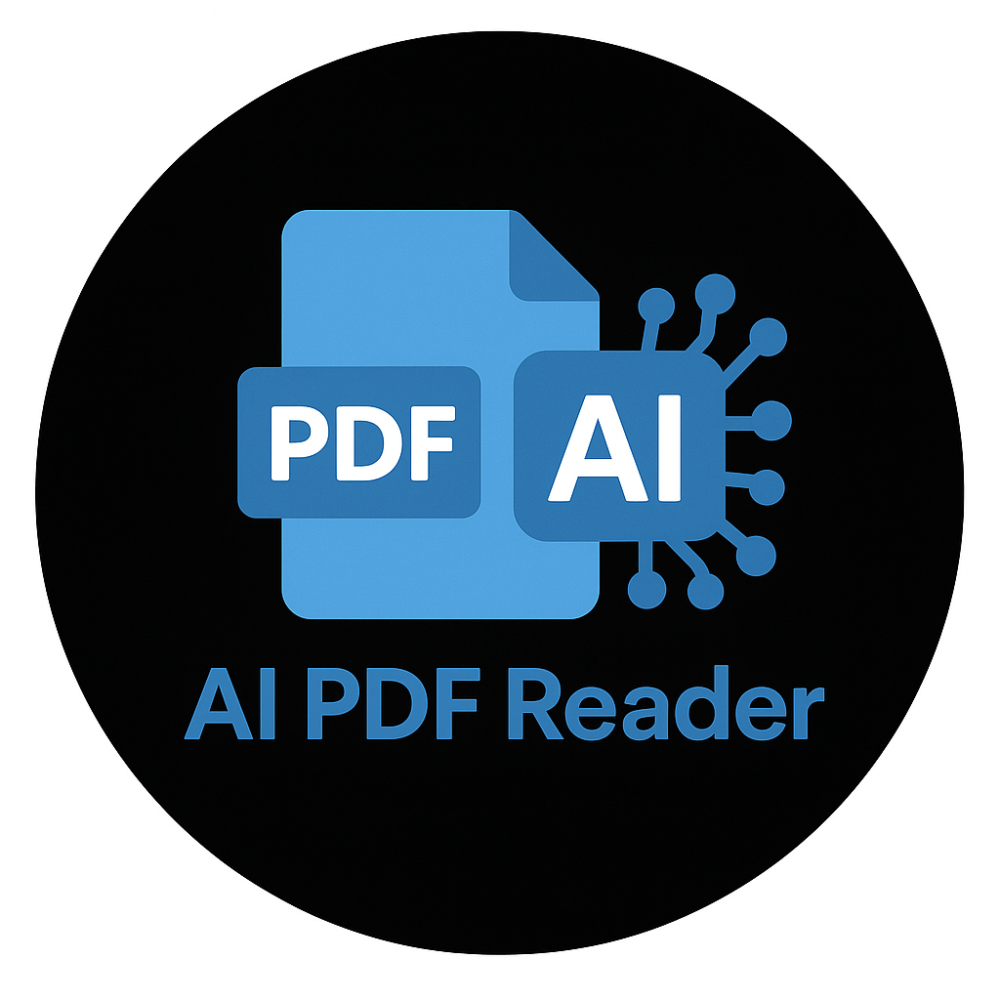

# AI PDF Reader

An AI-enhanced PDF reader that explains highlighted text. Built with Electron and React.

<p align="left">
  
</p>

## Features

- **PDF Viewing & Navigation**
  - Open and display PDF documents
  - Navigate between pages with intuitive controls and keyboard shortcuts
  - Direct page navigation with input field for quick jumps
  - Adjust zoom level for comfortable reading
  - Track and access recently opened documents
  - Remove documents from recent list with delete button

- **AI-Powered Text Analysis**
  - Highlight text to get instant AI explanations
  - Custom instruction input for personalized explanations
  - Built-in API key configuration for seamless setup

- **Advanced Chat Interface**
  - Ask follow-up questions about highlighted content
  - Multiple chat sessions for different sections of the document
  - Persistent chat history between application sessions
  - Last active chat tab remembered per document
  - Stream responses in real-time for better user experience

- **Highlighting & Annotation**
  - Create and save text highlights across the document
  - Highlights persist between reading sessions
  - Improved highlight removal and management
  - Quick navigation to highlighted sections

- **Cross-Platform Compatibility**
  - Available for Windows, macOS, and Linux
  - Consistent experience across all platforms

## 📋 Installation

### Linux

#### AppImage
```bash
# Download the AppImage
wget https://github.com/adrirubio/ai-pdf-reader/releases/download/v1.0.1/AI.PDF.Reader-1.0.1.AppImage

# Make it executable
chmod +x AI.PDF.Reader-1.0.1.AppImage

# Run it
./AI.PDF.Reader-1.0.1.AppImage --no-sandbox
```

#### DEB Package
```bash
# Download the DEB package
wget https://github.com/adrirubio/ai-pdf-reader/releases/download/v1.0.1/ai-pdf-reader_1.0.1_amd64.deb

# Install it
sudo dpkg -i ai-pdf-reader_1.0.1_amd64.deb

# Run it (after installation, you can run it from your applications menu or command line)
npm run build
ai-pdf-reader
```

### Windows
A Windows release is coming soon! In the meantime, you can run from source:

```bash
# Clone the repository
git clone https://github.com/adrirubio/ai-pdf-reader.git
cd ai-pdf-reader

# Install dependencies
npm install

# Run the application
npm run build
npm start
```

### macOS
You can run from source:

```bash
# Clone the repository
git clone https://github.com/adrirubio/ai-pdf-reader.git
cd ai-pdf-reader

# Install dependencies
npm install

# Run the application
npm run build
npm start
```

## Technologies Used

- Electron - Cross-platform desktop app framework
- React - UI library
- Redux - State management
- PDF.js - PDF rendering engine
- OpenAI API - AI-powered explanations and chat
- Webpack - Module bundler

## License

This project is licensed under the MIT License - see the [LICENSE](LICENSE) file for details.

## Acknowledgments

- [PDF.js](https://mozilla.github.io/pdf.js/) - Mozilla's PDF viewer
- [Electron](https://www.electronjs.org/) - For making cross-platform desktop apps easy
- [OpenAI](https://openai.com/) - For providing the AI capabilities
